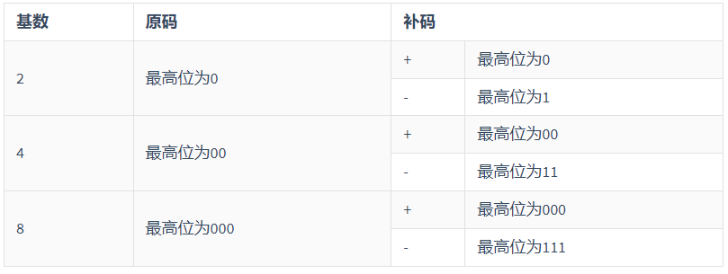

# 2.3 浮点数的表示和运算

## 2.3.1 浮点数的表示

### 1、浮点数的表示

浮点数通常表示为：

$$
N = r^{E}  \times M
$$

* r：阶码的底，通常为2
* E：**阶码**，反映浮点数的表示范围和小数点的实际位置，用**补码或移码**表示
* M：**尾数**，其位数反映了小数的精度，用**原码或补码**表示

> 例：阶码和尾数都用补码表示，求a、b的真值
>
> * a = 0,01; 1.1001
> * b = 0,01; 0.01001
>
> a：
>
> * 阶码0,01对应真值+1
> * 尾数0.1001对应真值-0.0111，也可看作-111右移四位： $$- \frac{7}{2^{4}}$$ 
> * 故 $$a = 2^{1} \times (-\frac{7}{2^{4}}) = - \frac{7}{8}$$ 
>
> b：
>
> * 阶码对应真值+1
> * 尾数0.01001对应真值+0.01001，也可看作+1001右移五位： $$+\frac{9}{2^{5}}$$ 
> * 故 $$b= 2^{1} \times \frac{9}{2^{5}} = \frac{9}{16}$$

### 2、浮点数的规格化

规定尾数的最高位必须是一个有效值。

**左规**：当浮点数运算的结果为非规格化时要进行规格化处理，将尾数左移一位，阶码减1 \( 基数为2时\)：

> 001; 00100\(1\)= $$2^{1} \times (+0.01001)$$ --&gt; $$2^{0} \times (+0.10010)$$ = 000; 01001\(0\)

**右规**：当浮点数运算的结果尾数出现溢出\(双符号位为01或10\)时，将尾数右移一位，阶码加1 \(基数为2时\)。

> 例：a=010; 00.1100；b = 010; 00.1000，求a+b
>
> $$a=2^{2}\times 00.1100\quad b=2^2\times00.1000\\ \begin{align}  a+b &= 2^{2} \times (00.1100 + 00.1000)\\ &= 2^{2} \times 01.0100\quad(\text{发生溢出})\\ &= 2^{3} \times 00.1010 \end{align}$$

规格化后的尾数满足： $$\frac{1}{r} \leq |M| \leq 1$$ 

**规格化的目的**：增加数据表示的精度

### 3、IEEE 754 标准

尾数前隐含一位1

| 类型 | 数阶 | 阶码 | 尾数数值 | 总位数 | 偏置值 |
| :---: | :---: | :---: | :---: | :---: | :---: |
| 短浮点数 | 1 | 8 | 23 | 32 | 7FH（127） |
| 长浮点数 | 1 | 11 | 52 | 64 | 3FFH（1023） |
| 临时浮点数 | 1 | 15 | 64 | 80 | 3FFFH |

* 规格化的短浮点数的真值为：$$(-1)^{S}\times 1.M \times 2^{E-127}$$ ；
* 规格化的长浮点数的真值为：$$(-1)^{S}\times 1.M \times 2^{E-1023}$$。

对于短浮点数而言，**偏置值取127**，此时阶码（移码）的表示范围为**-126~127**：

| 真值  |   补码    |   移码    |
| :---: | :-------: | :-------: |
| -128* | 1000 0000 | 1111 1111 |
| -127* | 1000 0001 | 0000 0000 |
| -126  | 1000 0010 | 0000 0001 |
|  ……   |    ……     |    ……     |
|   0   | 0000 0000 | 0111 1111 |
|  ……   |    ……     |    ……     |
|  127  | 0111 1111 | 1111 1110 |

-128和-127的作用：

* $$E = 0$$且$$M = 0$$，则真值为0；
* $$E = 0$$且$$M \neq 0$$ ，为非规格化数，真值 $$= (-1)^{S} \times 0.M \times 2^{-126}$$ ；
* $$E = 255$$且$$M \neq 0$$，真值为‘NaN’（非数值）；
* $$E = 255$$且$$M =0$$，真值为正或负无穷。 

> 例：将 -0.75D 转换为IEEE 754 的单精度浮点数格式表示

> - 将十进制转化为二进制
>   - $$-0.75 \text D=-0.11\text B$$
>
> - 将小数的高位变为1 （对应尾数隐含的1）
>   -  $$-0.11 =-(1.1)_2\times 2^{-1}$$
> - 数符：1
> - 尾数：取小数点后面部分，并补0
>   - .1000 0000 0000 0000 0000 000
> - 阶码：真值+偏移量
>   - $$(-1+127)\text D=126 \text D=0111 1110\text B$$
> - 结果：1 0111 1110 1000 0000 0000 0000 0000 000

> 例：IEEE 754的单精度浮点数 C0 A0 00 00 H的值是多少

> - 化为二进制
>   - 1100 0000 1010 0000 0000 0000 0000 0000
>   - 数符：1
>   - 阶码：1000 0001
>   - 尾数：0100 0000 0000 0000 0000 000
> - 尾数：加上隐含的1
>   - $$(1.01)_2$$
> - 阶码
>   - 先看作无符号数：1000 0001B = 129D
>   - 移码-偏置值：129-127=2
> - 真值：$$-(1.01)_2\times 2^2=-(1.25)_{10}\times2^2=-5.0$$

## 2.3.2 浮点数的运算

### 1、加减运算

**步骤**：

1. 对阶
2. 尾数加减
3. 规格化
4. 舍入
5. 判溢出

> 例：已知十进制数$$X=-\frac{5}{256}$$、$$Y=+\frac{59}{1024}$$，按机器补码浮点运算规则计算X-Y，结果用二进制表示，浮点数格式如下：阶符取2位，阶码取3位，数符取2位，尾数取9位

> $$5D=101B,\frac{1}{256}=2^{-8}\\ \begin{align}  X&=-101\times2^{-8}\\ &=-0.101\times2^{-5D} \\ &=-0.101\times2^{-101} \end{align}$$ 
>
> * 阶码
>   * -101，补码为：1011
>   * 阶符取两位、阶码取三位：11011
> * 尾数
>   * -0.101，补码为1.011
>   * 数符取两位，尾数取九位：11.011000000
> * 可得X：11011；11.011000000
>
> 同理：$$59D=111011B,\frac{1}{1024}=2^{-10}\\ \begin{align}  Y&=+111011\times2^{-10}\\ &=+0.111011\times2^{-4D} \\ &=+0.111011\times2^{-100} \end{align}$$
>
> * 阶码
>   * -100，补码为1100
>   * 阶符取两位、阶码取三位：11100
> * 尾数
>   * +0.111011，补码为0.111011
>   * 数符取两位，尾数取九位：00.111011000

#### （1）对阶

使两个数的阶码相等，小阶向大阶看齐，尾数每右移一位，阶码加1。

> $$[\Delta E]_{补}= 11011-11100=11011+00100=11111$$ 
>
> 11111为-1的补码，故 $$\Delta E = -1$$ ，X的阶码比Y的阶码小1
>
> 阶码每加1，尾数右移一位，则有新的X：11100；11.101100000（右移之后前面补1）
>
> 此时， $$X=-0.0101 \times 2^{-100}$$

#### （2）尾数相加减

> 首先有 -Y= 11100；11.000101000
>
> 尾数相加，得：
>
> $$\begin{array}{r}  11.101100000\\ +11.000101000\\ \hline 10.110001000 \end{array}$$ 
>
> 相当于提取公因式

#### （3）规格化

> 由于上一步发生了溢出，因此需要右规
>
> 尾数右移一位，阶码加1，得：X-Y=11101；11.011000100

#### （4）舍入


**“0”舍“1”入法**：类似于十进制数运算中的“四舍五入”法，即在尾数右移时，被移去的最高数值位为0，则舍去;被移去的最高数值位为1， 则在尾数的末位加1。这样做可能会使尾数又溢出，此时需再做一次右规。 

**恒置“1”法**：尾数右移时，不论丢掉的最高数值位是“1”还是“0”， 都使右移后的尾数末位恒置“1”。这种方法同样有使尾数变大和变小的两种可能。


无舍入

#### （5）判断溢出

未发生溢出

结果真值为 $$2^{-3}\times(-0.1001111)_{2}$$ 

### 2、强制类型转换

| 数据类型 | 16位机器 | 32位机器 | 64位机器 |
| :---: | :---: | :---: | :---: |
| char | 8 | 8 | 8 |
| short | 16 | 16 | 16 |
| int | 16 | 32 | 32 |
| long | 32 | 32 | 64 |
| long long | 64 | 64 | 64 |
| float | 16 | 32 | 32 |
| double | 64 | 64 | 64 |

char --&gt; int --&gt; long --&gt; double 以及 float --&gt; double，不会损失精度。

对于32位系统：

* int：表示整数，范围为 $$-2^{31} \sim 2^{31}-1$$，有效数字32位
* float：表示整数及小数，范围 $$\pm [2^{-126}\sim2^{127}\times(2-2^{-23})]$$ ，有效数字23+1=24位
* int --&gt; float：可能损失精度（有效数字比float多）
* float --&gt; int：可能**溢出**（超出int表示范围）及损失精度（小数部分）

