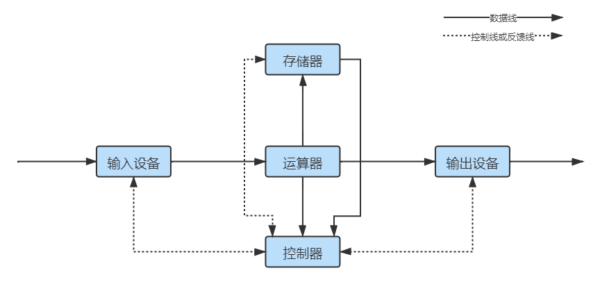
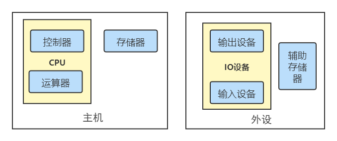
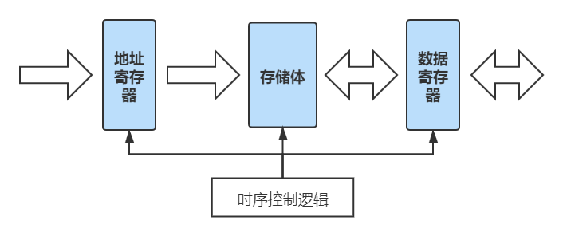
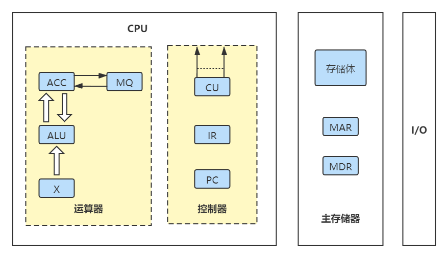

# 1.2 计算机系统层次结构

## 1.2.1 计算机硬件的组成

### 1、冯·诺依曼计算机

将指令以代码的形式存入主存储器中，之后按照顺序依次执行，知道程序执行结束。

#### 特点：

1. 计算机硬件系统由**运算器**、**存储器**、**控制器**、**输入设备**和**输出设备**5大部件组成；
2. 指令和数据以同等地位存于存储器内，并可**按地址寻访**；
3. 指令和数据均用二进制代码表示；
4. 指令由**操作码**和**地址码**组成
   * 操作码用来表示操作的性质；
   * 地址码用来表示操作数在存储器中的位置；
5. 指令在存储器内按顺序存放。通常指令是顺序执行的，在特定条件下，可根据运算结果或根据设定的条件改变执行顺序；
6. 早期的冯诺依曼机**以运算器为中心**，输入/输出设备通过运算器与存储器传送数据。

### 2、现代计算机的组织结构

### 3、计算机的功能部件

#### 一、存储器

存储器包括主存储器（主存、内存储器）和辅助存储器（辅存、外存储器）。

主存的组成如图所示：

* **存储体**：存放二进制信息；
* **地址寄存器（MAR，Memory Adders Register）**：存放访存地址，经过地址译码后找到相应的存储单元；
* **数据寄存器（MDR，Memory Data Register）**：暂存要从存储器中读或写的信息。


主存储器是由若干**存储单元**构成的，每个存储单元包含若干**存储元件**，每一个存储元件可以存储一位二进制代码0或1。因此每一个存储单元可以存储一串二进制码。这串二进制码称为**存储字**，它的位数称为**存储字长**，实际上就是存储单元中存储元件的个数。

例如，一个存储单元中有8个存储元件，则其存储字长为8位（bit），也可以称为1字节（B，Byte）。


有n位地址 = 有 $$2^{n}$$ 个存储单元 = MAR有n位。

#### 二、运算器

用于处理计算机的算术运算和逻辑运算。运算器包括：

* **算术逻辑单元**（ALU）（_核心_）
* 累加器（ACC）
* 乘商寄存器（MQ）
* 操作计数器（X）
* 变址寄存器（IX）
* 基址寄存器（BR）
* 程序状态寄存器（PSW）

#### 三、控制器

控制计算机各部件运行。包括：

* **控制单元**（CU）
* **指令寄存器（IR）**：存放当前执行指令的地址
* **程序计数器（PC）**：自动加1以得到下一条指令的地址

## 1.2.2 计算机的工作过程

M：主存中某存储单元

OP(IR)：取操作码

Ad(IR)：取地址码

### 一、取指令

1. PC --> MAR：将指令的地址从PC传至**地址寄存器**
2. M(MAR) --> MDR：根据地址从存储体中取到指令，并传至**数据寄存器**
3. (MDR) --> IR：将得到的指令传给**指令寄存器**

### 二、分析指令

1. OP(IR) --> CU：控制单元分析IR中的指令，并做出操作

### 三、执行指令

1. Ad(IR) --> MAR：IR将地址码给**地址寄存器**
2. M(MAR) --> MDR：地址寄存器找到数据，存至**数据寄存器**
3. (MDR) --> ACC：数据寄存器将数据传至**累加器**


CPU通过指令周期的不同阶段来区分指令和数据（即上面的一和三）


## 1.2.3 计算机的层次结构

* M4：用编译程序**翻译**成机器语言程序
* M3：用汇编程序**汇编**成机器语言程序
* M2：用机器语言**解释**操作系统
* M1：用微指令**解释**机器指令
* M0：由硬件**直接执行**微指令

- **翻译程序**：源程序→机器语言

  - **编译**（C++、Java）
    - 高级语言→机器语言
    - 通篇翻译
    - 仅需执行一次
    

  - **解释**（python、JS）
    - 高级语言→机器语言
    - 翻译一句执行一句
    - 每次执行都需要翻译

  - **汇编**
    - 汇编语言→机器语言

* 硬件和软件之间互相依存，协同发展
* 两者间没有严格的界限。

